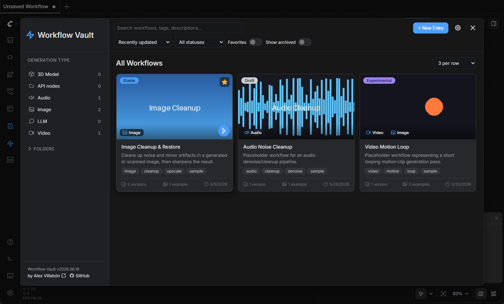

# ComfyUI Workflow Vault

A local, single-user workflow library built into ComfyUI. Save workflows as
structured "vault entries" with versions, example media, and Markdown
documentation — then browse, search, and reopen them later.

Everything is stored as plain files (JSON, Markdown, images/video/audio) in a
folder you choose on disk. No database, no account, no cloud sync.



## Installation

1. Copy (or clone) this folder into your ComfyUI `custom_nodes` directory, so
   you end up with `ComfyUI/custom_nodes/Comfy_Workflow_Vault/`.
2. Restart ComfyUI.
3. The backend uses the standard library plus `aiohttp` and `Pillow`, both
   already bundled by ComfyUI. The only extra dependency is `imageio-ffmpeg`,
   which ships a self-contained ffmpeg binary used to convert **video
   thumbnails** into animated WebP previews — many setups already have it (e.g.
   VideoHelperSuite depends on it). Everything degrades gracefully: without
   Pillow, image compression is skipped; without ffmpeg, you can still pick a
   still frame from a video for the thumbnail.

## First run

Two **Workflow Vault** buttons appear in the left sidebar rail:

- ⚡ **Vault** (lightning-bolt logo) — opens the vault to browse and manage your
  saved workflows.
- 💾 **Save** (save icon) — saves the current canvas to the vault. The Save
  wizard lets you create a new entry or update an existing one (overwrite the
  current version, or add a new version). If the canvas was opened from a vault
  entry, Save defaults to updating that entry.

The first time you open the vault, you'll be asked to choose a folder on disk
to use as your vault root. This folder is remembered for future sessions.

If you just want to explore the UI without setting anything up, click
**"Use included sample vault"** on that screen — it points the vault at the
`sample_vault/` folder bundled with this extension, which contains a few
example entries (image, video, and audio workflows) with versions, docs, and
example media already filled in. You can switch to your own folder later from
**Vault Settings** (⚙).

## Features

### Browse & search

- **Grid view** with search, status filter, Favorites and Show-archived
  toggles, sort controls (by name, created date, or last updated), and a
  **per-row density selector** (2, 3, or 4 columns) on the breadcrumb line.
- **Sidebar** leads with a **Generation Type** filter (Image, Video, Audio, 3D
  Model, LLM, API Nodes) with live counts, followed by a nested folder tree. An
  entry can carry more than one type and shows up under each.
- **Favorites** — star any entry from the grid card or detail view; favorites
  pin to the top in "last updated" sort order.
- **Grid cards** show the thumbnail, entry name, status, generation type
  badge(s), favorite toggle, and a one-click "open workflow" button. Thumbnails
  can be static images or **animated** (when made from a video) and loop
  automatically in the grid. Optional card fields (description, tags, version
  count, example count, date) are individually toggleable in settings for a
  cleaner look.
- **Accent color** — a single color tints all icons and the logo throughout the
  UI. Choose from preset swatches or a custom color picker; changes preview
  live before saving.

### Entry detail

- **Overview tab** — a read-only summary (description, tags, status, folder,
  generation type, and the thumbnail with **Open folder** and **Export (.zip)**
  buttons — the latter downloads the whole entry as a zip) followed by a full
  gallery of example media. Each example supports a before/after compare slider
  for image input/output pairs, a "reveal in folder" button per media item, and
  per-example notes.
- **Notes tab** — one or more Markdown notes per entry, shown as sub-tabs you
  can add, rename, and delete. Notes render as Markdown with a toggle for
  in-place editing.
- **Settings tab** with three sub-tabs:
  - **Workflow Details** — edit name, description, tags (with autocomplete),
    status, generation type, folder, favorite toggle, and thumbnail (image or
    video, same as the Save wizard), plus read-only stats (created/updated
    dates, version count, example count).
  - **Versions** — full version history: add a new version, overwrite the
    current one, promote a past version, and edit per-version notes.
  - **Examples** — add, edit, delete, and reorder examples and their
    input/output media, with live previews and drag-to-move between Inputs and
    Outputs.
- **Entry actions** (in the Settings tab) — **Duplicate** an entry into a new
  one (copies the thumbnail, tags, generation types, examples, and notes, plus
  only the current version), **Archive** / restore, and **Delete** (sent to the
  OS Recycle Bin / Trash where supported).

### Save wizard

- Save the current canvas as a **new entry** or as a **new version /
  overwrite** of an existing one, with notes, examples (input/output media),
  folder, favorite toggle, and a thumbnail — all in one step.
- A new entry requires a **name, a status, at least one tag, and at least one
  generation type** before it can be saved; anything missing is flagged inline.
  Status starts unset, so it's always a deliberate choice.
- **Thumbnails** accept an image *or* a video. Images are client-side
  downscaled to 512 px max (WebP at 0.8 quality; JPEG fallback). Dropping a
  video (MP4/MOV/WebM) offers two choices in the same slot:
  - **Animated** — the clip is converted server-side to a looping animated WebP
    preview (fit within 512 px, 18 fps, first 5 s).
  - **Static frame** — scrub to a frame and capture it as a still WebP, entirely
    in the browser (no ffmpeg needed).
  The untouched original (image or video) is kept as a separate archival source
  either way, and original file dates are preserved.

### Folder management

- Organize entries into nested folders. The sidebar shows the folder tree for
  filtering; create, rename, move, and delete folders from the **Organize** tab
  in Vault Settings. Deleting a folder moves its entries to Uncategorized — it
  never deletes entries.
- Inline **"Create new folder"** option in any folder picker.

### Image compression (Pillow)

- **Example images** are automatically re-encoded on upload to a smaller
  WebP or JPEG (WebP by default — keeps transparency and the embedded ComfyUI
  workflow so images stay drag-droppable into ComfyUI). Toggle on/off per vault.
- **Thumbnail source** — for image thumbnails, the full-resolution archival
  original is saved as a smaller WebP that keeps transparency and the same
  resolution, with the ComfyUI workflow still embedded — so it stays
  drag-droppable into ComfyUI. (Video sources are archived as-is, untouched.)
- **Batch compression** — a single action in Settings re-encodes all existing
  example images and thumbnail sources across the vault. Idempotent (files
  already compressed are skipped) and shows a completion summary (files
  converted, bytes before/after, percentage saved).
- Original file dates (modified and created) are always preserved on converted
  files.

### Global vault settings

Vault Settings (⚙) is organized into three tabs:

- **General**
  - **Vault location** — change or re-point the vault root folder at any time.
  - **Defaults** — show archived entries by default, and the placeholder-vs-blank
    behavior when an entry has no thumbnail.
  - **Card display** — toggle individual grid-card fields (Description, Tags,
    Version count, Example count, Date) on or off for a minimal look.
  - **Appearance** — accent color (preset swatches + custom picker, live preview).
- **Storage**
  - **Footprint** — a breakdown of disk usage: total on disk, a bar splitting
    space across example media / thumbnails / workflows, and counts of
    workflows, versions, examples, and tags.
  - **Compression** — example/thumbnail-source compression toggles and format
    choice (WebP/JPEG), plus a batch re-encode action.
  - **Backup** — download the entire vault (entries, media, versions, settings)
    as a single `.zip`.
- **Organize**
  - **Tags** — rename, merge (rename to an existing tag), or delete tags across
    all entries.
  - **Folders** — create, rename, move, or delete nested folders.

### Quality of life

- Version number, author credit, and link to GitHub repo in the sidebar footer.
- Sidebar rail icons and the vault logo are tinted by the accent color.
- Thumbnails use lazy loading for snappy grid performance at any library size.

## On-disk layout

```
<vault root>/
  vault_settings.json
  folders.json
  entries/
    <entry_slug>/
      manifest.json
      notes.json
      thumbnails/
        cover.<ext>         ← display thumbnail (image, animated WebP, or still)
        source.<ext>        ← archival original (image or video)
      versions/
        v001/{version.json, workflow.json}
        ...
      examples/
        example_001/{example.json, inputs/, outputs/}
        ...
```

## Notes

All vault data is plain files on disk, so it's easy to back up, move, or
inspect. The bundled `sample_vault/` is just example data — your own entries
live in whichever vault root you choose, separate from this extension.
