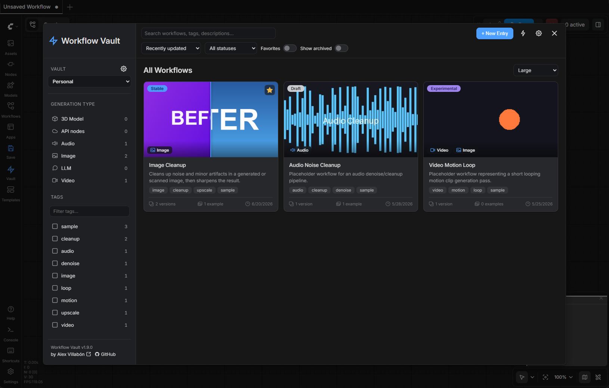

# ComfyUI Workflow Vault

A local, single-user workflow library built into ComfyUI. Save workflows as
structured "vault entries" with versions, example media, and Markdown
documentation — then browse, search, and reopen them later.

Everything is stored as plain files (JSON, Markdown, images/video/audio) in a
folder you choose on disk. No database, no account, no cloud sync.



## Installation

### ComfyUI Manager (recommended)

1. Open **ComfyUI Manager → Custom Nodes Manager** (the "Manager" button, then
   "Custom Nodes Manager" / "Install Custom Nodes").
2. Search for **Workflow Vault** and click **Install**.
3. Restart ComfyUI.

### Manual

1. Copy (or clone) this folder into your ComfyUI `custom_nodes` directory, so
   you end up with `ComfyUI/custom_nodes/Comfy_Workflow_Vault/`.
2. Restart ComfyUI.

### Dependencies

The backend uses the standard library plus `aiohttp` and `Pillow`, both already
bundled by ComfyUI. The only extra dependency is `imageio-ffmpeg`, which ships a
self-contained ffmpeg binary used to convert **videos** (for thumbnails and
compare images) into animated WebP previews — many setups already have it (e.g.
VideoHelperSuite depends on it). Everything degrades gracefully: without Pillow,
image compression is skipped; without ffmpeg, you can still pick a still frame
from a video.

## First run

Two **Workflow Vault** buttons appear in the left sidebar rail:

- ⚡ **Vault** (lightning-bolt logo) — opens the vault to browse and manage your
  saved workflows.
- 💾 **Save** (save icon) — saves the current canvas to the vault. The Save
  wizard lets you create a new entry or update an existing one (overwrite the
  current version, or add a new version). If the canvas was opened from a vault
  entry, Save defaults to updating that entry.

The first time you open the vault, you'll be asked to choose a folder on disk
to use as your vault root. This folder is remembered for future sessions.

If you just want to explore the UI without setting anything up, click
**"Use included sample vault"** on that screen — it points the vault at the
`sample_vault/` folder bundled with this extension, which contains a few
example entries (image, video, and audio workflows) with versions, docs, and
example media already filled in. You can switch to your own folder later from
**Vault Settings** (⚙).

## Features

### Browse & search

- **Grid view** with search, status filter, Favorites and Show-archived
  toggles, sort controls (by name, created date, or last updated), and a
  **per-row density selector** (2, 3, or 4 columns) on the breadcrumb line.
- **Sidebar filters** with live counts:
  - **Generation Type** (Image, Video, Audio, 3D Model, LLM, API Nodes). An
    entry can carry more than one type and shows up under each.
  - **Tags** — a multi-select list of every tag in the vault, each with its
    usage count. Pick several to narrow to entries that carry **all** of them
    (combined with AND); selected tags float to the top, a **Filter tags…** box
    finds a specific one in large vaults, and a **Clear** button drops the whole
    selection. Active tags also appear as removable chips next to the title, and
    tag pills on the grid cards are clickable to add/remove a filter.
- **Favorites** — star any entry from the grid card or detail view; favorites
  pin to the top in "last updated" sort order.
- **Grid cards** show the thumbnail, entry name, status, generation type
  badge(s), favorite toggle, and a one-click "open workflow" button. Thumbnails
  can be static images or **animated** (when made from a video) and loop
  automatically in the grid. Optional card fields (description, tags, version
  count, example count, date) are individually toggleable in settings for a
  cleaner look.
- **Before/after compare thumbnails** — give an entry an optional second
  "compare image" and its card shows a **hover-to-wipe compare slider**: move
  the cursor left/right across the card to reveal the thumbnail ("after") versus
  the compare image ("before"). The compare image accepts the same formats as
  the thumbnail (image *or* video, animated or a captured still). Entries
  without one fall back to the normal hover-zoom thumbnail.
- **Accent color** — a single color tints all icons and the logo throughout the
  UI. Choose from preset swatches or a custom color picker; changes preview
  live before saving.

### Entry detail

- **Overview tab** — a read-only summary (description, tags, status,
  generation type, and the thumbnail with **Open folder** and **Export (.zip)**
  buttons — the latter downloads the whole entry as a zip) followed by a full
  gallery of example media. When the entry has a compare image, the Overview
  thumbnail itself becomes the same hover-to-wipe compare slider used on the
  grid card. Each example supports a before/after compare slider for image
  input/output pairs, a "reveal in folder" button per media item, and
  per-example notes.
- **Notes tab** — one or more Markdown notes per entry, shown as sub-tabs you
  can add, rename, and delete. Notes render as Markdown with a toggle for
  in-place editing.
- **Settings tab** with three sub-tabs:
  - **Workflow Details** — edit name, description, tags (with autocomplete),
    status, generation type, favorite toggle, and thumbnail (image or
    video, same as the Save wizard), plus read-only stats (created/updated
    dates, version count, example count).
  - **Versions** — full version history: add a new version, overwrite the
    current one, promote a past version, and edit per-version notes.
  - **Examples** — add, edit, delete, and reorder examples and their
    input/output media, with live previews and drag-to-move between Inputs and
    Outputs. Media can be dropped, browsed, or pasted (Ctrl+V / **Paste from
    clipboard**) into either the Inputs or the Outputs zone.
- **Entry actions** (in the Settings tab) — **Duplicate** an entry into a new
  one (copies the thumbnail, tags, generation types, examples, and notes, plus
  only the current version), **Archive** / restore, and **Delete** (sent to the
  OS Recycle Bin / Trash where supported).

### Save wizard

- Save the current canvas as a **new entry** or as a **new version /
  overwrite** of an existing one, with notes, examples (input/output media),
  favorite toggle, and a thumbnail — all in one step.
- A new entry requires a **name, a status, at least one tag, and at least one
  generation type** before it can be saved; anything missing is flagged inline.
  Status starts unset, so it's always a deliberate choice.
- **Thumbnails** accept an image *or* a video. Images are client-side
  downscaled to 512 px max (WebP at 0.8 quality; JPEG fallback). Dropping a
  video (MP4/MOV/WebM) offers two choices in the same slot:
  - **Animated** — the clip is converted server-side to a looping animated WebP
    preview (fit within 512 px, 18 fps, first 5 s).
  - **Static frame** — scrub to a frame and capture it as a still WebP, entirely
    in the browser (no ffmpeg needed).
  The untouched original (image or video) is kept as a separate archival source
  either way, and original file dates are preserved. A × on the preview clears
  the pick, here and in **Settings → Workflow Details**.
- **Paste from the clipboard** — every media box takes the clipboard as well as
  drops: the thumbnail, the compare image, and each example's Inputs / Outputs
  section. Press **Ctrl+V** with the box focused or under the cursor, or click
  **Paste from clipboard**. A paste lands in exactly one box (focus wins over
  the cursor), example pastes keep the input/output role of the section they
  land in, and text on the clipboard is left alone. Screenshots come in as
  images; files copied in Explorer/Finder arrive with their own names, so a
  copied video still offers the animated-vs-frame choice and several copied
  files land in one go. Firefox adds its own confirmation popup to the button —
  that prompt is the browser's, so Ctrl+V is the one-gesture route there.
- **Compare image** (optional) — a second media slot with the exact same picker
  and behavior as the thumbnail (image or video, animated or captured still).
  When set, it becomes the "before" layer of the hover compare slider on the
  grid card and Overview preview. Its untouched original is archived too, and a
  × clears it. Also editable later from **Settings → Workflow Details**.

### Organization (tag-first)

- The vault is **tag-first**: organize and filter with **tags**, plus **status**,
  **favorites**, **generation type**, and full-text **search**. A workflow is
  multi-dimensional (e.g. Flux, portrait, upscaler, client-ready, heavy-vram), so
  tags fit it better than forcing a single folder "home."
- **Tags** are added per entry in the Save wizard and the entry editor, filtered
  on from the **sidebar Tags facet** (multi-select, AND), and managed vault-wide
  in **Settings → Organization** (rename, merge, delete across all entries).
- **Legacy folders:** vaults created before folders were deprecated keep their
  folder data untouched. **Settings → Organization** shows a one-time conversion
  that turns folder-path names into plain tags (e.g. `Image / Cleanup` →
  `image`, `cleanup`). It lists each folder name with a checkbox and a count, so
  you choose which to keep and untick any junk folders before converting.
  Nothing is deleted — `folders.json` and the entries' folder assignments are
  preserved, so it's safe to re-run.

### Image compression (Pillow)

- **Example images** are automatically re-encoded on upload to a smaller
  WebP or JPEG (WebP by default — keeps transparency and the embedded ComfyUI
  workflow so images stay drag-droppable into ComfyUI). Toggle on/off per vault.
- **Thumbnail source** — for image thumbnails, the full-resolution archival
  original is saved as a smaller WebP that keeps transparency and the same
  resolution, with the ComfyUI workflow still embedded — so it stays
  drag-droppable into ComfyUI. (Video sources are archived as-is, untouched.)
- **Batch compression** — a single action in Settings re-encodes all existing
  example images and thumbnail sources across the vault. Idempotent (files
  already compressed are skipped) and shows a completion summary (files
  converted, bytes before/after, percentage saved).
- Original file dates (modified and created) are always preserved on converted
  files.

### Global vault settings

Vault Settings (⚙) is organized into three tabs:

- **General**
  - **Vault location** — change or re-point the vault root folder at any time.
  - **Defaults** — show archived entries by default, and the placeholder-vs-blank
    behavior when an entry has no thumbnail.
  - **Card display** — toggle individual grid-card fields (Description, Tags,
    Version count, Example count, Date) on or off for a minimal look.
  - **Appearance** — accent color (preset swatches + custom picker, live preview).
- **Organization**
  - **Tags** — rename, merge (rename to an existing tag), or delete tags across
    all entries.
  - **Legacy folders** — appears only if the vault still has folder assignments
    from before folders were deprecated; offers a one-time conversion of folder
    paths into tags, with a checkbox per folder name so you choose which to
    apply. Folder data is preserved, never deleted.
- **Storage**
  - **Footprint** — a breakdown of disk usage: total on disk, a bar splitting
    space across example media / thumbnails / workflows, and counts of
    workflows, versions, examples, and tags.
  - **Compression** — example/thumbnail-source compression toggles and format
    choice (WebP/JPEG), plus a batch re-encode action.
  - **Backup** — download the entire vault (entries, media, versions, settings)
    as a single `.zip`.
  - **Health** — check the vault for interrupted saves, orphan entry folders,
    and missing referenced media/workflows. The same panel can clean
    `.wv_staging_*` interrupted-save folders by moving them to the OS
    Trash/Recycle Bin where supported.

### Quality of life

- Version number, author credit, and link to GitHub repo in the sidebar footer.
- Sidebar rail icons and the vault logo are tinted by the accent color.
- Thumbnails use lazy loading for snappy grid performance at any library size.

## On-disk layout

```
<vault root>/
  vault_settings.json
  folders.json             ← legacy (folders are deprecated; preserved if present)
  entries/
    <entry_slug>/
      manifest.json
      notes.json
      thumbnails/
        cover.<ext>          ← display thumbnail (image, animated WebP, or still)
        source.<ext>         ← archival original (image or video)
        compare.<ext>        ← optional compare "before" image (animated WebP or still)
        compare_source.<ext> ← archival original of the compare image
      versions/
        v001/{version.json, workflow.json}
        ...
      examples/
        example_001/{example.json, inputs/, outputs/}
        ...
```

## Recovery and backups

- The vault is plain files, so the best backup is a copy of the whole vault
  folder or the **Settings → Storage → Export vault (.zip)** action.
- Whole-entry deletes, example deletes, individual example-media deletes, and
  interrupted-save cleanup use the OS Trash/Recycle Bin where supported. If the
  OS has no usable trash mechanism, deletion falls back to permanent removal.
- New entries are written into hidden `.wv_staging_*` folders first, then moved
  into place only after the manifest and related files are complete. If ComfyUI
  exits during a save, the Storage tab's Health panel can detect and clean
  those staging folders.
- Health checks are read-only. Cleanup only targets `.wv_staging_*` folders; it
  does not delete complete entries.
- Before running batch compression or large cleanup work, make a vault export or
  copy the vault folder.
- The selected vault location is stored beside the extension in
  `vault_config.json`, not inside the vault. Moving a ComfyUI install may require
  pointing Workflow Vault at the vault folder again.

## Troubleshooting

### A video shows "Can't play this video" with a Save an H.264 copy button

The browser reported it can't decode that file's format at all. The usual cause
is **H.265/HEVC**: Firefox on Windows plays it only through a hardware decoder
and has no software fallback, so an HEVC output plays fine in Chrome and shows
nothing in Firefox. 10-bit HEVC (`yuv420p10le`) is what ComfyUI writes when a
Video Combine node is set to `h265-mp4`.

Click **Save an H.264 copy** on the failed player. The vault re-encodes the clip
to 8-bit H.264 — the one profile every browser decodes — and points the entry at
the copy. The conversion:

- **keeps the original file** on disk next to the copy (`clip.mp4` →
  `clip_h264.mp4`), because re-encoding is lossy and drops 10-bit to 8-bit;
- **preserves the embedded ComfyUI workflow** byte-for-byte, so the converted
  file is still drag-droppable onto the canvas;
- keeps the original's modified/created dates, so sorting doesn't change.

It needs ffmpeg (bundled via `imageio-ffmpeg`). To avoid the problem at the
source, set your Video Combine node's format to `h264-mp4` rather than
`h265-mp4`.

### Example videos show playback controls but won't play (stuck at 0:00 / 0:00)

This is the *other* video failure, and Convert won't help — the format is fine,
decoding just never starts. Videos load but never show a frame: blank player,
black thumbnails in the example filmstrip, no error message. Images in the same
entry load fine, and the same vault plays normally in Chrome or Edge.

This is a browser video-decoding problem, not a vault problem. It shows up on
machines that have a **virtual display adapter** installed — Parsec, Sunshine /
Moonlight, RDP, or a VM — which is common for a headless ComfyUI box you drive
remotely. Firefox picks one adapter for hardware video decoding, and if it lands
on the virtual one (which has no decoder) it doesn't reliably fall back to
software decoding.

Fix, in Firefox:

1. Open `about:config` and accept the warning.
2. Search for `media.hardware-video-decoding.enabled`.
3. Double-click it to set it to `false`.
4. Fully quit and restart Firefox — not just the tab.

This forces software decoding, which handles typical example clips comfortably.
It's fully reversible. If that doesn't help, check `about:support` → Graphics to
see which adapter Firefox chose, or point Firefox at the real GPU via **Windows
Settings → System → Display → Graphics → Add desktop app → firefox.exe →
Options → High performance**.

## Manual smoke checklist

Before calling a build release-ready, test it in a live ComfyUI session:

- ComfyUI starts and both Save/Vault sidebar buttons appear.
- Create a new entry with a thumbnail, compare image, notes, and example media.
- Rename that entry and verify its versions, thumbnail, compare image, and
  examples still open.
- Open the saved workflow, then save back as a new version and as an overwrite.
- Add, reorder, rename, and delete example media; deleted media should go to the
  OS Trash/Recycle Bin where supported.
- Export a single entry and the full vault.
- Run **Settings → Storage → Health → Check vault** and confirm the report is
  clean for the test vault.

## Notes

All vault data is plain files on disk, so it's easy to back up, move, or
inspect. The bundled `sample_vault/` is just example data — your own entries
live in whichever vault root you choose, separate from this extension.

## License

Released under the **GNU General Public License v3.0** (see [LICENSE](LICENSE)).
You're free to use, study, modify, and share it; derivative works must remain
open under the same license. GPL-3.0 is compatible with ComfyUI (itself
GPL-3.0).
